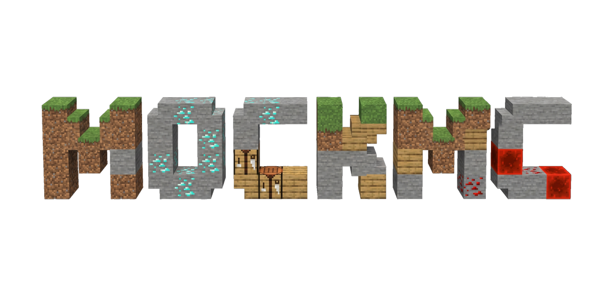

<p align="center">
    <!-- Badges -->
    <a href="https://github.com/SecondLifeGaming/MockMC/actions/">
        
    </a>
    <a href="https://central.sonatype.com/artifact/io.github.secondlifegaming/mockmc-v26.1">
        
    </a>
    <a href="https://javadoc.io/doc/io.github.secondlifegaming/mockmc-v26.1">
        
    </a>
    <a href="https://sonarcloud.io/project/issues?resolved=false&types=CODE_SMELL&id=SecondLifeGaming_MockMC">
        
    </a>
    <a href="https://sonarcloud.io/component_measures?id=SecondLifeGaming_MockMC&metric=sqale_rating&view=list">
        
    </a>
    <a href="https://sonarcloud.io/project/issues?resolved=false&types=BUG&id=SecondLifeGaming_MockMC">
        
    </a>
    <a href="https://codecov.io/gh/SecondLifeGaming/MockMC" >
        
    </a>
    <!-- Logo -->
    <hr />
        
    <hr />
</p>

MockMC is a testing framework for Minecraft server software. It provides complete mock implementations of server environments, allowing you to run unit tests for your plugins with speed and precision.

## 🚀 The "Engine First" Strategy

MockMC moves beyond the maintenance-heavy approach of previous frameworks. While earlier versions utilized a `metaminer` to generate base stubs, they still required significant manual overhead to keep the mock surface in sync with rapidly evolving APIs like Paper and Folia.

### The Maintenance Bottleneck

In traditional mocking, every upstream update (like a new Minecraft version) forced developers to manually update mock classes to satisfy new interface contracts. If a method wasn't manually implemented or correctly shadowed, it would throw an `UnimplementedOperationException`, causing tests to be skipped and stalling development.

### The Metaminer & JavaPoet Evolution

We have overhauled the `metaminer` engine to act as a direct bridge between the API JARs and your test environment using **JavaPoet**:

- **Universal JAR Scraping**: Our engine doesn't rely on hardcoded source paths. It scrapes directly from provided JARs, allowing instant support for **Paper, Folia, Velocity, BungeeCord, and Waterfall**.
- **Automated Smart Stubs**: Using JavaPoet, we generate 100% of the API surface. Every method—even those added in a brand-new Paper update—is immediately available with safe, type-specific defaults (Empty collections, Optionals, etc.).
- **Logic over Boilerplate**: Because the engine handles the thousands of interface methods automatically, our manual implementation efforts are focused strictly on **simulating complex logic**.

## Usage

MockMC is available via Maven Central.

> [!TIP]
> **Latest Version:**
> [](<[https://central.sonatype.com/artifact/io.github.secondlifegaming/mockmc-v26.1](https://central.sonatype.com/artifact/io.github.secondlifegaming/mockmc-v26.1)>)

<details>
<summary><h3>Adding MockMC via Gradle</h3></summary>

MockMC is available on Maven Central. Since we utilize an **Engine First** approach, we recommend a small helper script to automatically pull the correct Paper-API version directly from the MockMC manifest. This ensures your testing environment always stays in sync with the internal stubs.

```gradle
repositories {
    mavenCentral()
    maven { url 'https://repo.papermc.io/repository/maven-public/' }
}

// Helper to extract the Paper version from the MockMC JAR
def getMockMCPaperVersion() {
    def mockmcJar = configurations.testImplementation.resolve().find { it.name.contains('mockmc-') }
    if (mockmcJar) {
        def jarFile = new java.util.jar.JarFile(mockmcJar)
        def paperVersion = jarFile.manifest.mainAttributes.getValue('Paper-Version')
        jarFile.close()
        return paperVersion ?: '1.21-R0.1-SNAPSHOT'
    }
    return '1.21-R0.1-SNAPSHOT'
}

dependencies {
    // Replace with the latest version from Maven Central
    testImplementation 'io.github.secondlifegaming:mockmc-v26.1:dev-2a95b9a32'

    // Dynamically pull the correct Paper API
    testImplementation "io.papermc.paper:paper-api:${getMockMCPaperVersion()}"
}
```

</details>

<details>
<summary><h3>Adding MockMC via Maven</h3></summary>

Add the Paper repository and the MockMC dependency to your `pom.xml`. To ensure proper class loading, place the MockMC dependency **above** any other dependencies that might provide the Bukkit or Paper API.

```xml
<repositories>
    <repository>
        <id>papermc</id>
        <url>https://repo.papermc.io/repository/maven-public/</url>
    </repository>
</repositories>

<dependencies>
    <dependency>
        <groupId>io.github.secondlifegaming</groupId>
        <artifactId>mockmc-v26.1</artifactId>
        <version>dev-2a95b9a32</version>
        <scope>test</scope>
    </dependency>

    <dependency>
        <groupId>io.papermc.paper</groupId>
        <artifactId>paper-api</artifactId>
        <version>1.21-R0.1-SNAPSHOT</version>
        <scope>test</scope>
    </dependency>
</dependencies>
```

</details>

### Using MockMC

Initialize the mock environment in your test setup:

```java
private ServerMock server;
private MyPlugin plugin;

@BeforeEach
public void setUp() {
    server = MockMC.mock();
    plugin = MockMC.load(MyPlugin.class);
}

@AfterEach
public void tearDown() {
    MockMC.unmock();
}
```

### Mock Plugins

Create lightweight "dummy" plugins to test cross-plugin dependencies or event listeners.

```java
PluginMock plugin = MockMC.createMockPlugin();
```

### Mock Players

Simulate complex player interactions, including inventory movements, chats, and block interactions.

```java
PlayerMock player = server.addPlayer();
player.simulateBlockBreak(someBlock); // Fires events and updates world state
```

### Mock Worlds

MockMC uses a "Lazy-Loading" world strategy. Blocks are only created in memory when accessed, keeping memory usage low even for large-scale tests.

```java
// Create a superflat world with bedrock at y=0 and dirt up to y=3
World world = new WorldMock(Material.DIRT, 3);
```

## :question: UnimplementedOperationException

While the **Engine First** strategy ensures all methods exist, specific complex logic (like physical entity collisions or advanced lighting updates) might still throw an `UnimplementedOperationException` if the manual behavior hasn't been coded yet.

Because this extends `AssumptionException`, JUnit will mark the test as **skipped** rather than **failed**, preventing false negatives in your CI/CD pipeline while highlighting areas where MockMC's behavioral logic needs a PR.
